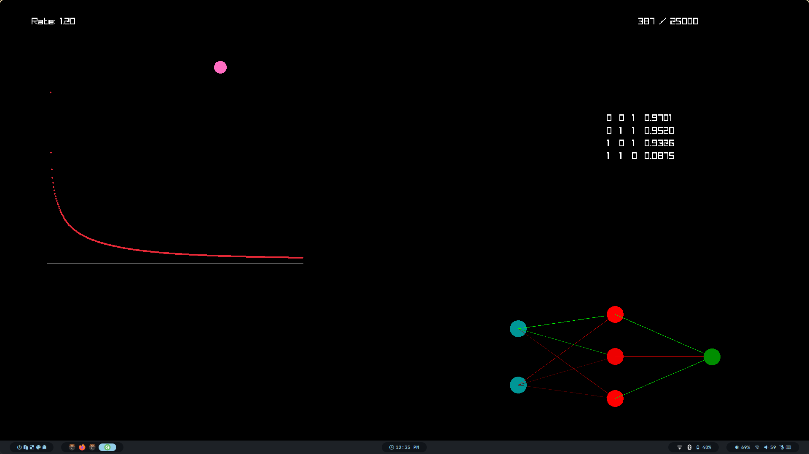

# Logic Gates AI

A.I. in Rust capable of solving Logic Gates using a Neural Network with linear Regression. 

- Use the slider to control the learning rate.

I used raylib ( https://www.raylib.com/ ) to manage the window.

There is also a file to upscale images using the same Neural Network, but is very slow since I didn't optimized it yet.

## Screenshots




## Installation

Download the repository and execute:

```bash
    cargo run --bin logicGates -v
```

## Globals and variables

Globals:

- `DATA` Desire Logic Gate to learn (AND, OR, XOR, NAND)

- `LEN_ARC` Number of hidden layers 

- `ARC` Format of the hidden layers 

- `NUM_NEURONS` Total number of neurons 

## Acknowledgements

 - Inspired by Tsodin Porject ( https://youtu.be/PGSba51aRYU?si=QogqQE1VkJ9B_6Uy )

